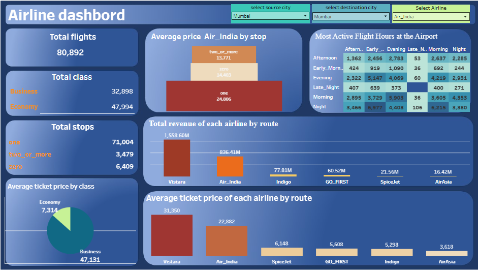
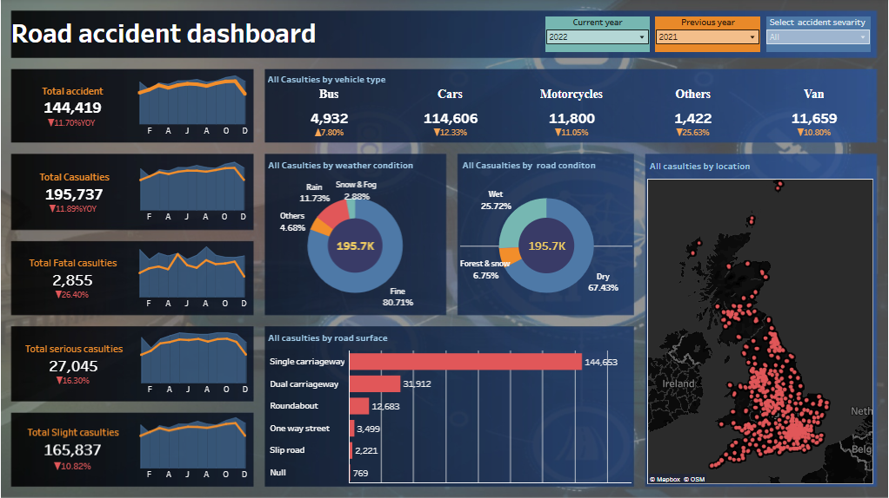
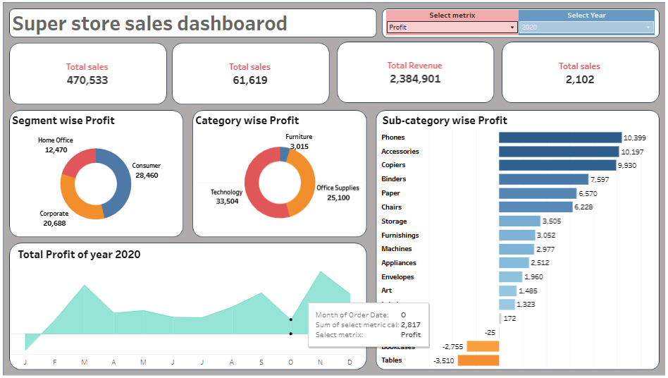

# Tableau Dashboards Portfolio 📊

I am exploring interactive data visualization using Tableau. Here are some of the dashboards I created:

---

## 1️⃣ Airline Analytics Dashboard ✈

Link: [View on Tableau Public](https://public.tableau.com/app/profile/foziya.bano/viz/new_airline_data/Dashboard1)

**Description:**
- Explore flights data interactively:
  - Select Airline, Source City, Destination City
  - KPIs like total flights, total classes
  - Revenue generated by each airline
- Aim: Practice data visualization and make flight insights more accessible.
- Features allow analyzing airline performance, pricing, strategies, and revenue trends.

---

## 2️⃣ Road Accident Dashboard 🚦

Link: [View on Tableau Public](https://public.tableau.com/app/profile/foziya.bano/viz/accident_dashboard_17630578382620/Dashboard2)

**Description:**
- Analyze road accident trends over time
- Explore severity based on different locations
- Interactive filters and visuals for deeper insights
- Part of my journey in Visualization and Analytics

---

## 3️⃣ Superstore Dashboard 🛒

Link: [View on Tableau Public](https://public.tableau.com/app/profile/foziya.bano/viz/Superstoredashboar/Dashboard1)

**Description:**
- Dynamic metric selector (Sales, Profit, Revenue, Discount, Quantity)
- Year parameter works with metric selector to update visuals
- Interactive charts to analyze business performance
- Added filters to make dataset user-friendly
- Focused on designing interactive visuals for easy insights

---
